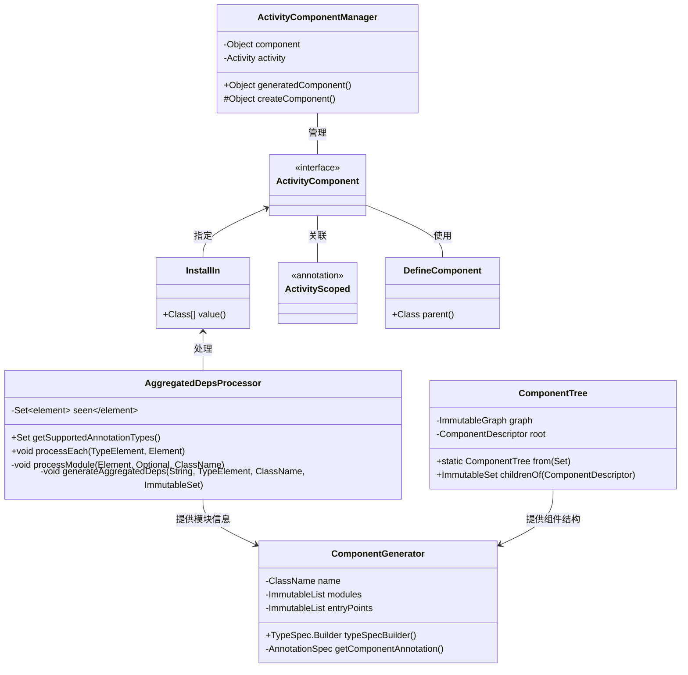
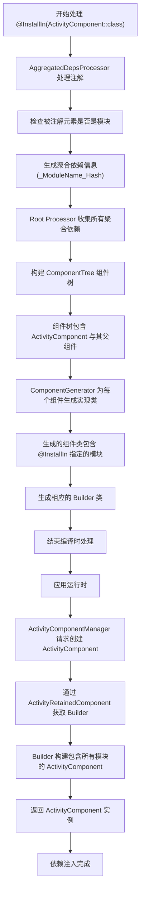
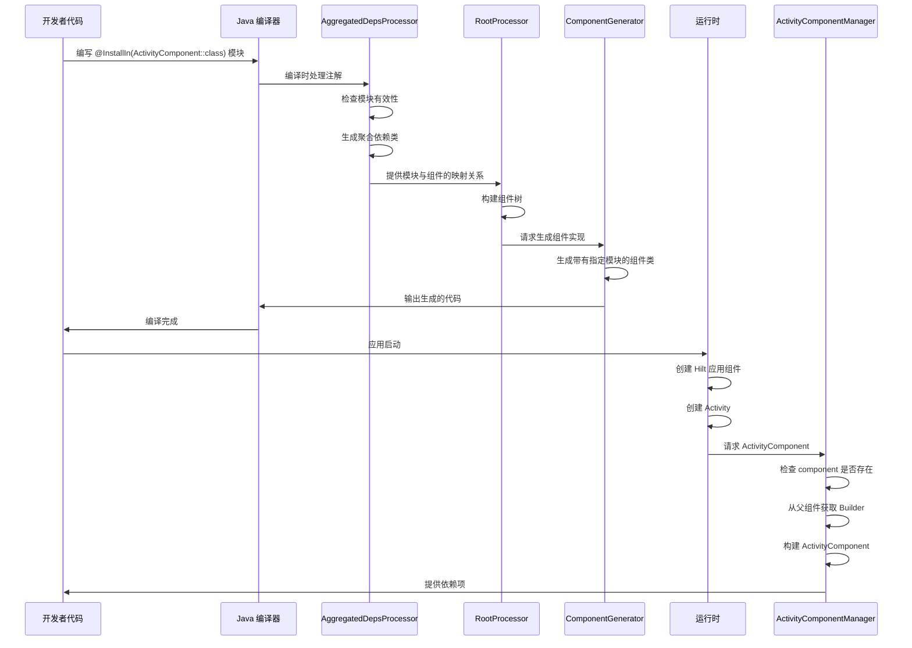

# Hilt 依赖注入库 @InstallIn 注解底层实现原理

## 源码分析

### InstallIn 注解的定义

```kotlin
// 源文件：dagger/hilt/InstallIn.java（Dagger 2.40.1）
@Retention(CLASS)
@Target({ElementType.TYPE})
@GeneratesRootInput
public @interface InstallIn {
  Class<?>[] value();
}
```

此注解接受一个组件类的数组作为值，用于指定被标注的模块应该安装在哪些组件中。

### ActivityComponent 的定义

```kotlin
// 源文件：dagger/hilt/android/components/ActivityComponent.java（Dagger 2.40.1）
@ActivityScoped
@DefineComponent(parent = ActivityRetainedComponent.class)
public interface ActivityComponent {}
```

这是一个标准的 Hilt 组件接口，它使用了 `@DefineComponent` 注解定义了自己的父组件是 `ActivityRetainedComponent`。

## 核心实现原理

### 1. 编译时注解处理

Hilt 使用注解处理器在编译时处理 `@InstallIn` 注解。主要由 `AggregatedDepsProcessor` 处理器完成：

```java
// 源文件：dagger/hilt/processor/internal/aggregateddeps/AggregatedDepsProcessor.java（Dagger 2.40.1）
@IncrementalAnnotationProcessor(ISOLATING)
@AutoService(Processor.class)
public final class AggregatedDepsProcessor extends BaseProcessor {
  
  private static final ImmutableSet<ClassName> INSTALL_IN_ANNOTATIONS =
      ImmutableSet.of(ClassNames.INSTALL_IN, ClassNames.TEST_INSTALL_IN);
  
  @Override
  public void processEach(TypeElement annotation, Element element) throws Exception {
    // 检查元素是否已经处理过
    if (!seen.add(element)) {
      return;
    }

    // 获取元素上的 @InstallIn 注解
    Optional<ClassName> installInAnnotation = getAnnotation(element, INSTALL_IN_ANNOTATIONS);
    Optional<ClassName> entryPointAnnotation = getAnnotation(element, ENTRY_POINT_ANNOTATIONS);
    Optional<ClassName> moduleAnnotation = getAnnotation(element, MODULE_ANNOTATIONS);

    boolean hasInstallIn = installInAnnotation.isPresent();
    boolean isEntryPoint = entryPointAnnotation.isPresent();
    boolean isModule = moduleAnnotation.isPresent();

    // 检查是否为模块类型
    if (isModule) {
      processModule(element, installInAnnotation, moduleAnnotation.get());
    } else if (isEntryPoint) {
      processEntryPoint(element, installInAnnotation, entryPointAnnotation.get());
    }
  }
  
  private void processModule(Element element, Optional<ClassName> installInAnnotation, ClassName moduleAnnotation) {
    // 确保模块有 @InstallIn 注解
    ProcessorErrors.checkState(
        installInAnnotation.isPresent() || isDaggerGeneratedModule(element) || installInCheckDisabled(element),
        element,
        "%s is missing an @InstallIn annotation...");
        
    // 如果没有 @InstallIn 注解，不需要进一步处理
    if (!installInAnnotation.isPresent()) {
      return;
    }
    
    // 生成聚合依赖信息
    generateAggregatedDeps(
        Processors.getFullEnclosedName(element),
        asType(element),
        installInAnnotation.get(),
        ImmutableSet.of());
  }
  
  private void generateAggregatedDeps(
      String key,
      TypeElement element,
      ClassName annotation,
      ImmutableSet<ClassName> replacedModules)
      throws Exception {
    // 创建包含模块和组件信息的聚合依赖类
    // 这些聚合类会在稍后被用于生成最终的组件实现
    new AggregatedDepsGenerator(
        getProcessingEnv(),
        key,
        element,
        annotation,
        replacedModules).generate();
  }
}
```

### 2. 聚合依赖信息生成

`AggregatedDepsProcessor` 处理器会为带有 `@InstallIn` 注解的模块生成一个名为 `_<ModuleName>_<Hash>` 的类，该类包含了模块和目标组件的信息。例如：

```java
// 自动生成的聚合依赖类示例
@AggregatedDeps(
    components = "dagger.hilt.android.components.ActivityComponent",
    modules = "com.example.MyModule"
)
public class _MyModule_12345 {}
```

### 3. 组件树构建

组件树的构建是通过 `ComponentTree` 类实现的：

```java
// 源文件：dagger/hilt/processor/internal/root/ComponentTree.java（Dagger 2.40.1）
final class ComponentTree {
  private final ImmutableGraph<ComponentDescriptor> graph;
  private final ComponentDescriptor root;
  
  // 从组件描述符集合创建组件树
  static ComponentTree from(Set<ComponentDescriptor> descriptors) {
    MutableGraph<ComponentDescriptor> graph =
        GraphBuilder.directed().allowsSelfLoops(false).build();
        
    descriptors.forEach(
        descriptor -> {
          graph.addNode(descriptor);
          descriptor.parent().ifPresent(parent -> graph.putEdge(parent, descriptor));
        });
        
    return new ComponentTree(ImmutableGraph.copyOf(graph));
  }
}
```

此类创建了一个有向图，表示 Hilt 组件之间的父子关系。

### 4. 组件生成

组件生成是由 `ComponentGenerator` 完成的：

```java
// 源文件：dagger/hilt/processor/internal/root/ComponentGenerator.java（Dagger 2.40.1）
final class ComponentGenerator {
  private final ProcessingEnvironment processingEnv;
  private final ClassName name;
  private final Optional<ClassName> superclass;
  private final ImmutableList<ClassName> modules;  // 包括通过 @InstallIn 指定的模块
  private final ImmutableList<TypeName> entryPoints;
  private final ImmutableCollection<ClassName> scopes;
  private final ClassName componentAnnotation;
  
  public TypeSpec.Builder typeSpecBuilder() throws IOException {
    TypeSpec.Builder builder =
        TypeSpec.classBuilder(name)
            .addModifiers(Modifier.PUBLIC, Modifier.ABSTRACT)
            .addAnnotation(getComponentAnnotation()); // 添加 @Component 注解与模块列表
            
    // 添加其他必要的元素
    componentBuilder.ifPresent(builder::addType);
    scopes.forEach(builder::addAnnotation);
    addEntryPoints(builder);
    superclass.ifPresent(builder::superclass);
    
    return builder;
  }
  
  // 生成包含模块列表的组件注解
  private AnnotationSpec getComponentAnnotation() {
    AnnotationSpec.Builder builder = AnnotationSpec.builder(componentAnnotation);
    modules.forEach(module -> builder.addMember("modules", "$T.class", module));
    return builder.build();
  }
}
```

### 5. 运行时组件管理

在运行时，`ActivityComponentManager` 负责管理 Activity 组件的创建和生命周期：

```java
// 源文件：dagger/hilt/android/internal/managers/ActivityComponentManager.java（Dagger 2.40.1）
public class ActivityComponentManager implements GeneratedComponentManager<Object> {
  // 入口点，用于获取 ActivityComponentBuilder
  @EntryPoint
  @InstallIn(ActivityRetainedComponent.class)
  public interface ActivityComponentBuilderEntryPoint {
    ActivityComponentBuilder activityComponentBuilder();
  }
  
  private volatile Object component;
  private final Object componentLock = new Object();
  protected final Activity activity;
  private final GeneratedComponentManager<ActivityRetainedComponent> activityRetainedComponentManager;
  
  // 获取或创建组件实例
  @Override
  public Object generatedComponent() {
    if (component == null) {
      synchronized (componentLock) {
        if (component == null) {
          component = createComponent();
        }
      }
    }
    return component;
  }
  
  // 创建组件实例
  protected Object createComponent() {
    // 检查应用是否是 Hilt 应用
    if (!(activity.getApplication() instanceof GeneratedComponentManager)) {
      // 抛出异常提示...
    }
    
    // 通过 ActivityRetainedComponent 获取 ActivityComponentBuilder
    return EntryPoints.get(
            activityRetainedComponentManager, ActivityComponentBuilderEntryPoint.class)
        .activityComponentBuilder()
        .activity(activity)
        .build(); // 构建 ActivityComponent 实例
  }
}
```

## 图表说明

### 类图（使用 Mermaid 语法）



### 流程图（使用 Mermaid 语法）



### 时序图（使用 Mermaid 语法）



## 实现要点总结

1. **编译时处理**：
   - Hilt 通过 `AggregatedDepsProcessor` 在编译时处理 `@InstallIn` 注解
   - 它为每个带有 `@InstallIn` 的模块生成聚合依赖信息类

2. **组件树构建**：
   - 使用 `ComponentTree` 构建组件之间的父子关系图
   - `ActivityComponent` 的父组件是 `ActivityRetainedComponent`

3. **代码生成**：
   - `ComponentGenerator` 根据组件树和模块信息生成 Dagger 组件实现
   - 自动将标记了 `@InstallIn(ActivityComponent::class)` 的模块添加到组件的 modules 列表中

4. **运行时组件管理**：
   - `ActivityComponentManager` 负责在运行时创建和管理 `ActivityComponent` 实例
   - 组件实例通过其父组件的 Builder 创建，并包含所有指定的模块

这就是 Hilt `@InstallIn(ActivityComponent::class)` 注解的底层实现原理，它通过注解处理和代码生成实现了依赖注入的自动配置，大大简化了 Android 应用中的依赖注入使用方式。
